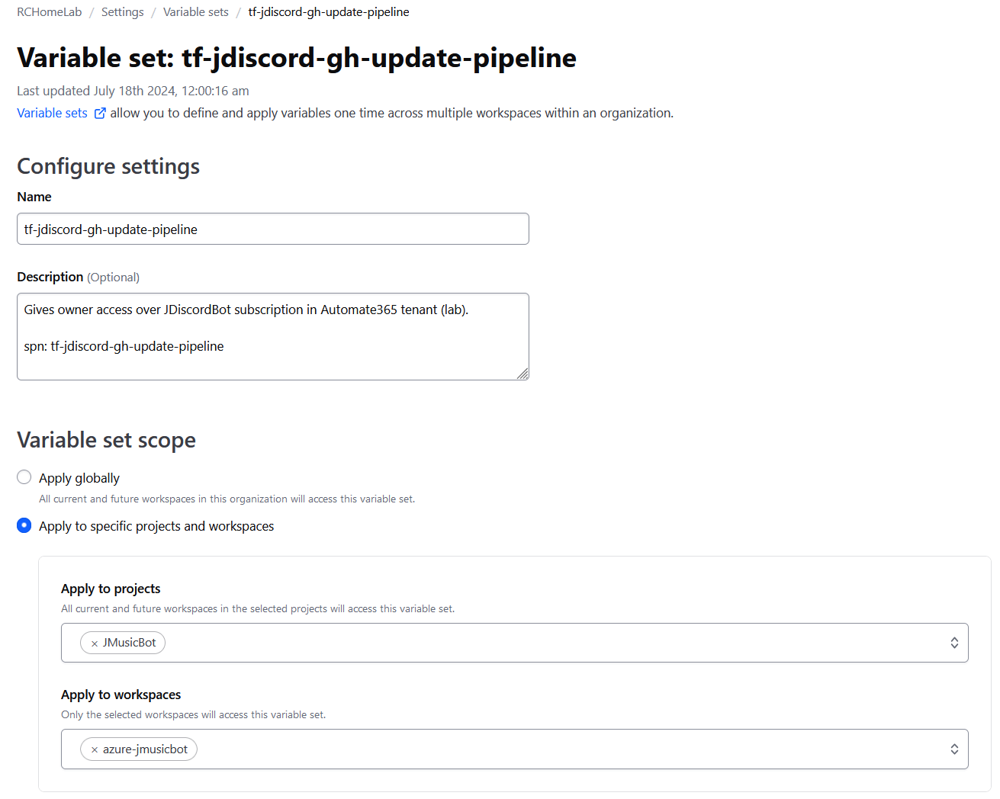
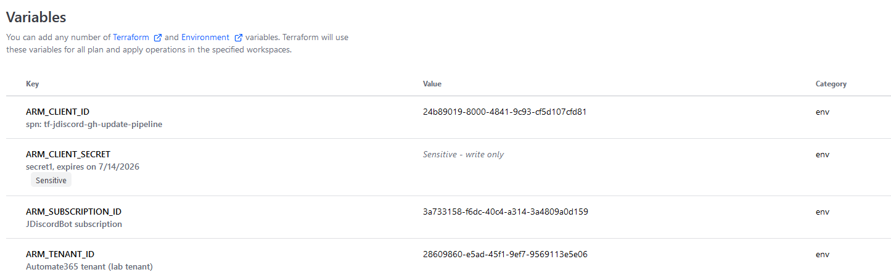
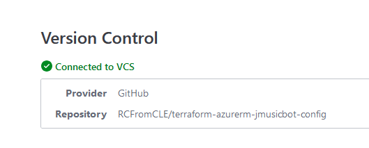
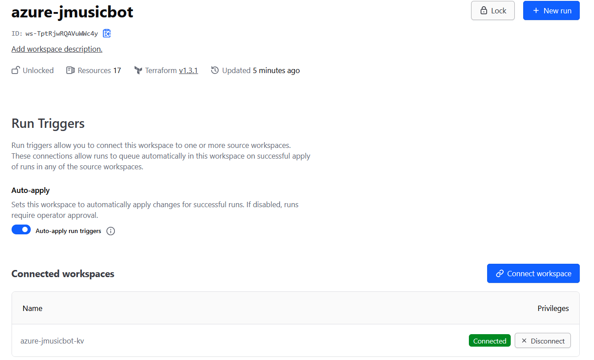

# terraform-azurerm-jmusicbot-config

This configuration repository automates the deployment of JMusicBot on Azure using Terraform and GitHub Actions.


[](https://github.com/RCFromCLE/terraform-azurerm-jmusicbot-config/actions/workflows/trigger-terraform-apply.yml)

### Prerequisites

- Azure subscription
- VS Code with the below extensions:
   - Azure Tools
   - PowerShell
   - GitHub Actions
   - Terraform - HashiCorp
   - HCP - Terraform
- GitHub account
- Terraform Cloud account and Organization
- Azure CLI installed locally
- Discord Application (Bot) with necessary permissions and token

## Setup Instructions

1. Launch VS Code and open the PowerShell Terminal. Fork and clone this repository:

```powershell
   git clone https://github.com/<your-username>/terraform-azurerm-jmusicbot-config.git
   cd terraform-azurerm-jmusicbot-config/jdiscord-kv-config
```

**Run Trigger Configuration**: Configure the Azure primary workspace with a run trigger to execute after the Azure Key Vault workspace completes its run.

2. Create Azure Service Principal. Be sure to take note of the cliend_id upon creation. Open the Azure portal and create a secret for this registered application (SPN), hold on to this secret we will use it soon. 

```powershell
   az login
   az ad sp create-for-rbac --name "tf-jdiscord-gh-update-pipeline" --role contributor --scopes /subscriptions/<your-subscription-id>
```

3. Run terraform login and sign in to your TF Cloud organization. Set each main.tf's terraform block to contain the correct organization and workspace information from your TF Cloud org.

**Two Terraform Cloud Workspaces**
   - **Azure Key Vault Workspace**: Created first, contains secrets needed in Azure to deploy and run JMusicBot.
   - **Azure Primary Workspace**: Created second and dependent on the Azure Key Vault workspace will deploy JMusicBot and its supporting resources.

```powershell
 terraform login
```

```hcl
   terraform {
     cloud {
       organization = "YourOrganization"
       workspaces {
         name = "azure-jmusicbot-kv"
       }
     }
   }
```
```hcl
   terraform {
     cloud {
       organization = "YourOrganization"
       workspaces {
         name = "azure-jmusicbot-primary"
       }
     }
   }
```

4. Configure Terraform Variables

Fill in `terraform.tfvars` with your Azure and Discord details and run `terraform init` for each workspace.

#### Key Vault Workspace (`terraform.tfvars`):

```hcl
subscription_id = ""
location = "East US"
kv_resource_group_name = "jdiscord-kv-rg"
key_vault_name = "jdiscord-kv"
discord_bot_token = ""
discord_bot_owner = ""
discord_bot_prefix = "!"
additional_access_policy_object_id = ""
```

#### Primary Workspace (`terraform.tfvars`):

```hcl
sub                 = ""
afk_channel_id      = ""
azure_client_id     = ""
azure_client_secret = ""
azure_tenant_id     = ""
discord_bot_owner   = ""
discord_bot_prefix  = "!"
discord_bot_token   = ""
general_channel_id  = ""
music_channel_id    = ""    
```

**Note**: You can use `set_workspace_variable.ps1` to automatically create variables in the Terraform Cloud Workspace from your local variables. Simply fill out your Terraform API token, org name, and workspace name, place the script in the same directory as `terraform.tfvars`, and run the script.

5. Configure Terraform Cloud Workspaces

After running `terraform init` for both the Key Vault and primary configurations, verify that you can see the workspaces in Terraform Cloud. They will not have a run status until after the first run.



6. Create a variable set with the following environment variables:
   - `ARM_CLIENT_ID`
   - `ARM_CLIENT_SECRET`
   - `ARM_SUBSCRIPTION_ID`
   - `ARM_TENANT_ID`

7. Assign this variable set to both workspaces.

At this point, you should have each workspace set up with the required workspace and environment variables.



8. Enable VCS integration for each workspace:
   - Select your GitHub config repository
   - For the Key Vault workspace, set the correct working directory: `jdiscord-kv-config`



9. In the primary workspace, set the run trigger to execute after the Key Vault workspace completes.



### Deployment

You can now trigger a run by:

- Pushing a change to the main branch of the Key Vault config directory, or
- Manually run a plan and apply in the Key Vault workspace through the Terraform Cloud UI


Once the Key Vault workspace has completed, the primary workspace will automatically trigger and run.

### Verification

After completion, you should have a fully deployed JMusicBot. Verify the deployment by:
-  Checking the Azure VM
-  Confirming the function app is running
-  Ensuring the bot is online in Discord and can play music
-  Confirming the bot joins when you have at least one user in the music channel
-  Confirm bot responds to "start music bot" within 5 minutes and the bot joins within 6 minutes.

Now that your solution is deployed we need to setup the secrets each GitHub Action workflow will require. This is so we can keep the MusicBot running the latest version as sometimes only the latest version is the working version and manually performing updates can suck.

10.  ### Setup GitHub Actions Secrets for Workflows

- **`AZURE_CREDENTIALS`**: Azure Service Principal credentials
  - [How to create and configure Azure Service Principal credentials](https://learn.microsoft.com/en-us/entra/identity-platform/howto-create-service-principal-portal)
- **`AZURE_FUNCTIONAPP_PUBLISH_PROFILE`**: Azure Function App publish profile
  - [How to get the Azure Function App publish profile](https://learn.microsoft.com/en-us/visualstudio/azure/how-to-get-publish-profile-from-azure-app-service?view=vs-2022)
- **`AZURE_FUNCTION_APP_NAME`**: Azure Function App name
- **`AZURE_RESOURCE_GROUP`**: Azure Resource Group name
- **`AZURE_VM_NAME`**: Azure VM name
- **`PAT_TOKEN`**: GitHub Personal Access Token
   - [How to create a GitHub Personal Access Token](https://docs.github.com/en/authentication/keeping-your-account-and-data-secure/managing-your-personal-access-tokens#creating-a-personal-access-token-classic)
- **`TF_API_TOKEN`**: Terraform Cloud API Token
   - [How to create a Terraform Cloud API Token](https://aws-quickstart.github.io/workshop-terraform-modules/40_setup_cloud9_ide/43_setup_tfc_api_token.html)
- **`TF_CLOUD_ORGANIZATION`**: Terraform Cloud organization name
   - [How to set up your Terraform Cloud organization](https://app.terraform.io/public/signup/account?utm_source=learn&ajs_aid=18f0a77a-627a-43ee-a824-d34056b25463&product_intent=terraform)
- **`TF_WORKSPACE_NAME`**: Terraform Cloud workspace name
   - [How to create a Terraform Cloud workspace](https://developer.hashicorp.com/terraform/tutorials/cloud-get-started/cloud-workspace-create)


### GitHub Actions Workflows:
   - ###### File:  `deploy-function.yml` | Title - deploy-function
   - ###### File:  `trigger-terraform-apply.yml` | Title - Check for JMusicBot Update and TF Apply

##### deploy-function
*Note*: If you manually run this it will deploy the function within the function/jdiscord-function directory. If you 
- Triggers: Push to master, manual
- Environment: dev
- Steps: Checkout code, Setup Node.js, Install dependencies, Build and test, Deploy to Azure Functions

##### Check for Module Update and TF Apply
*Note*: If you manually trigger this workflow, it will run and terraform apply regardless of if there is an update to JMusicBot, scheduled runs will only run if there is an update to [`terraform-azurerm-jmusicbot`](https://github.com/RCFromCLE/terraform-azurerm-jmusicbot).
- Triggers: Daily at 5:30 AM EST, manual
- Steps: 
  - Check for updates to the terraform-azurerm-jmusicbot module and JMusicBot jar
  - Update configurations
  - Azure login and Terraform init to download the latest terraform-azurerm-jmusicbot module
  - VM state management 
  - Terraform operations - Plan, Apply
  - Conditions: If updates are found, If VM is off, If VM is on

#### Module Structure

This project uses the [`terraform-azurerm-jmusicbot`](https://github.com/RCFromCLE/terraform-azurerm-jmusicbot) module, which sets up the following Azure resources:

- Azure Virtual Machine: Runs the JMusicBot application
- Virtual Network and Subnet: Provides network isolation
- Network Security Group (NSG): Controls inbound and outbound traffic
- Public IP: Allows external access to the VM
- Azure Key Vault: Securely stores sensitive information in the project
- Azure Function App: Manages the VM lifecycle based on Discord activity

#### Automatic Updates

Checks for new module and jar releases, updates, configurations, and triggers Terraform apply if updates are found.

#### VM Management

The workflow intelligently manages the VM's power state when it runs.

 - Pre-update Check: Verifies the VM's current power state.
 - Activation: If the VM is off, the workflow starts before applying changes.
 - Update Process: Applies necessary updates and configuration changes while the VM is running.
 - State Restoration: After updates, if the VM was initially off, the workflow returns it to a powered-off state.

## Troubleshooting

1. Check GitHub Actions logs
2 Check function app log stream and invocation logs
3. Use the serial console option under help and support section of the VM to connect and confirm the jdiscordbot.service is running and connected to your Discord server properly. See https://jmusicbot.com/troubleshooting/ for additional troubleshooting information.
4. Confirm you are using the correct secrets in each of your Terraform Cloud workspace variables sections.
5. Verify GitHub actions repository secrets
6. Confirm Azure credentials and permissions
7. Review Terraform Cloud workspace runs

Open an issue in this repository or the terraform-azurerm-jmusicbot repository for persistent problems.
